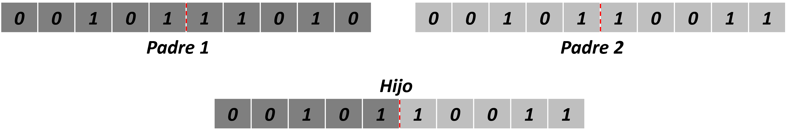
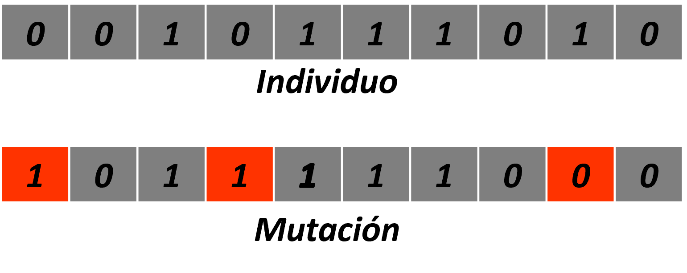
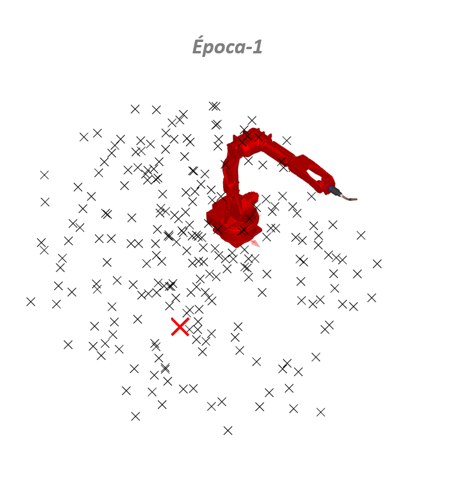
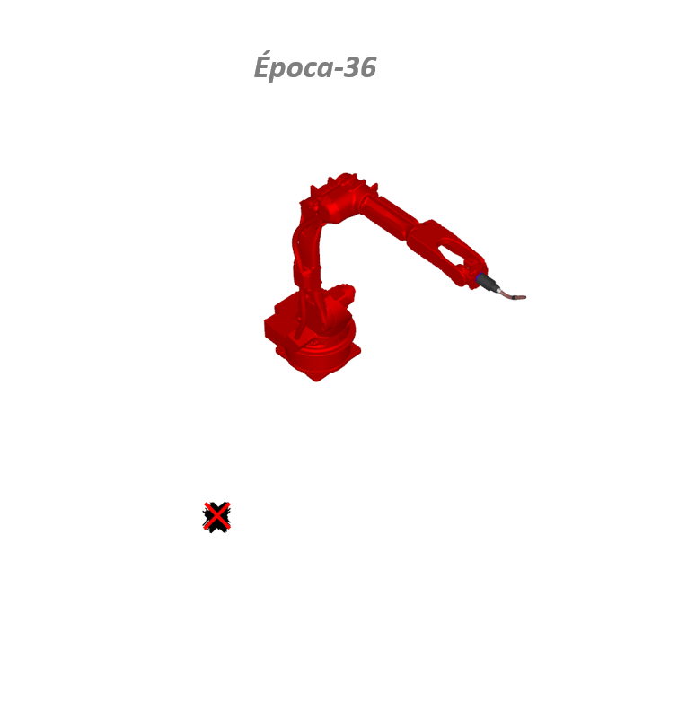

---
jupyter:
  kernelspec:
    display_name: Python 3
    language: python
    name: python3
  language_info:
    codemirror_mode:
      name: ipython
      version: 3
    file_extension: .py
    mimetype: text/x-python
    name: python
    nbconvert_exporter: python
    pygments_lexer: ipython3
    version: 3.8.7
  nbformat: 4
  nbformat_minor: 2
  orig_nbformat: 4
---

::: {.cell .markdown}
```{=html}
<center>
```
```{=html}
<div>

</div>
```
​`<center>`{=html}

**`<center>`{=html} Optimización `<center>`{=html}** ​

```{=html}
<center>
```
Maestría en Cómputo Estadístico `<center>`{=html} `<center>`{=html}
Enero a junio 2023 `<center>`{=html} `<br>`{=html}

```{=html}
<center>
```
Eduardo Vilchhis Marín `<center>`{=html} `<center>`{=html} Guillermo
Martínez Tizoc `<center>`{=html}

**`<center>`{=html}Optimización Combinatoria`<center>`{=html}**
`<br>`{=html}`<br>`{=html}
:::

::: {.cell .code execution_count="1"}
``` python
# ********************************************************************
#                 I M P O R T A R - L I B R E R I A S
# ********************************************************************
import numpy as np
import pandas as pd
import random
import itertools
from bitstring import BitArray
from tqdm import tqdm

import os
import shutil
from pathlib import Path
```
:::

::: {.cell .code execution_count="2"}
``` python
# >> Ruta del proyecto
module_path = os.path.abspath(os.getcwd())
```
:::

::: {.cell .code execution_count="3"}
``` python
# >> Imprimir en consola
#
#
def prRed(skk): return("\033[91m {}\033[00m" .format(skk))

def prGreen(skk): return("\033[1;92m {}\033[00m" .format(skk))
 
def prYellow(skk): return("\033[93m {}\033[00m" .format(skk))
 
def prLightPurple(skk): return("\033[1;94m {}\033[00m" .format(skk))
 
def prPurple(skk): return("\033[1;95m {}\033[00m" .format(skk))
 
def prCyan(skk): return("\033[96m {}\033[00m" .format(skk))
 
def prLightGray(skk): return("\033[97m {}\033[00m" .format(skk))
 
def prBlack(skk): return("\033[1;98m {}\033[00m" .format(skk))
```
:::

::: {.cell .code execution_count="4"}
``` python
# >> Creamos una clase para escritura y le lectura de archivos
#
# Version 2.1
class Files():
    def __init__(self, parent = None):
        self.parent = parent
    # Version 1.2
    def is_file_in_use(self, file_path):
        path = Path(file_path)
        if not path.exists():
            return False
        try:
            path.rename(path)
        except PermissionError:
            return True
        else:
            return False
    # Version 1.2
    def write_file(self, file_path, data=[], type_mode="w"):
        __run = True
        while __run:
            __status = False
            if os.path.isfile(file_path):
                __status = self.is_file_in_use(file_path=file_path)
            if not __status:
                try:
                    __file_input = open(file_path, type_mode, encoding="utf-8", errors="replace")
                    for __value in data:
                        __value = str(__value).replace("\n", "")
                        __file_input.write(str(__value) + "\n")
                    __file_input.close()
                    __run = False
                    break
                except:
                    print("Error...")
    # Version 1
    def readSingleLineFile(self, __filepath):
        __sline = ""
        __file = open(__filepath, "r", encoding="utf-8", errors="replace")
        __content = __file.readlines()
        __file.close()
        for __line in __content:
            if __line.find("#") != -1:
                pass
            else:
                if (__line == "") or (__line == "\n"):
                    pass
                else:
                    __sline = __line.replace("\n", "")
        return __sline
    # Version 1
    def readFile(self, filepath):
        __content = []
        __fullpath = os.path.abspath(str(filepath))
        if os.path.isfile(__fullpath):
            __ofile = open(__fullpath, "r", encoding="utf-8", errors="replace")
            __content = __ofile.readlines()
            __ofile.close()
        return __content
    # Version 1.2
    def write_file_string(self, file_path, data_string, type_mode="w"):
        __run = True
        while __run:
            __status = False
            if os.path.isfile(file_path):
                __status = self.is_file_in_use(file_path=file_path)
            if not __status:
                try:
                    __file_input = open(file_path, type_mode, encoding="utf-8", errors="replace")
                    __file_input.write(data_string)
                    __file_input.close()
                    __run = False
                except:
                    pass
            # time.sleep(3)
```
:::

::: {.cell .code execution_count="5"}
``` python
# >> Instanciar la clase Files()
files = Files()
```
:::

::: {.cell .code execution_count="6"}
``` python
# >> Crear carpetas para guardar resultados
output_path =os.path.join(module_path, "output")
coodinate_population_folder = os.path.join(output_path, "Coordinates_population")
fitness_folder = os.path.join(output_path, "Fitness")
def restart_folders():
    if not os.path.isdir(output_path):
        os.mkdir(output_path
        )
    else:
        for folder in os.listdir(output_path):
            shutil.rmtree(os.path.join(output_path, folder))

    if not os.path.isdir(coodinate_population_folder):
        os.mkdir(coodinate_population_folder)

    if not os.path.isdir(fitness_folder):
        os.mkdir(fitness_folder)
restart_folders()
fitness_file = os.path.join(fitness_folder, "Fistness.txt")
best_angles_file = os.path.join(fitness_folder, "Angles.txt")
log_path = os.path.join(fitness_folder, "log.txt")
```
:::

::: {.cell .markdown}

------------------------------------------------------------------------

**`<center>`{=html}`<span style="color:blue">`{=html}Denavit
Hartemberg`</span>`{=html}`</center>`{=html}`</br>`{=html}`</br>`{=html}**
**`<center>`{=html}Sistema de coordenadas del robot
6GDL`</center>`{=html}**`<br>`{=html}`<br>`{=html} \*\*\*\*\*
`<center>`{=html} `<div>`{=html}
``{=html}
`</div>`{=html} ​`<center>`{=html}
:::

::: {.cell .markdown}
**`<span style="color:blue">`{=html}Nata:`</span>`{=html}**`<br>`{=html}

-   `<span style="color:gray">`{=html}Unidades en
    mm`</span>`{=html}`<br>`{=html}
-   **Comenzaremos el trabajo desde la descripción de Denavit-Hartenberg
    para el robot con 6GDL.**
:::

::: {.cell .markdown}
**`<center>`{=html}Tabla de Denavit-Hartemberg`</center>`{=html}**

```{=html}
<center>   

| link | $\bm{\theta_{i-1}}$ | $\bm{d_{i-1}}$ | $\bm{\alpha_{i-1}}$ | $\bm{a_{i-1}}$| 
| ---: | ---: | ---: | ---: | ---: |
|  1  |  0  | 505 | 150 | -90 |
|  2  |  90 |   0 |-760 |  0  |
|  3  |  0  |   0 |-200 |  90 |
|  4  |  0  |1082 |   0 | -90 |
|  5  |  0  |   0 |   0 |  90 |
|  6  |  0  | 100 |   0 |  0  |
|  7  |  0  |   0 | -89 |  0  |

</center>
```
```{=html}
<!-- </div> -->
```
:::

::: {.cell .markdown}

------------------------------------------------------------------------
:::

::: {.cell .markdown}
# **`<center>`{=html}`<span style="color:blue">`{=html}Algoritmo Genético`</span>`{=html}`</center>`{=html}**`<br>`{=html} {#algoritmo-genético-}
:::

::: {.cell .markdown}
**`<center>`{=html}Función Objectivo`<br>`{=html}`<br>`{=html}**
$\bm{z: min \sqrt{\sum_{i=1}^{3} \left[P_{final_{1x3}} - P_{i_{1x3}}\right]^2}}$`<br>`{=html}`<br>`{=html}
**Restricciones:**

$\bm{-180 \leq \theta_1 \geq 180}$`<br>`{=html}
$\bm{-105 \leq \theta_2 \geq 155}$`<br>`{=html}
$\bm{-86 \leq \theta_3 \geq 160}$`<br>`{=html}
$\bm{-150 \leq \theta_3 \geq 150}$`<br>`{=html}
$\bm{-135 \leq \theta_3 \geq 90}$`<br>`{=html}
$\bm{-210 \leq \theta_3 \geq 210}$

```{=html}
</center>
```
:::

::: {.cell .markdown}
```{=html}
<center><span style="color:black">La función objetivo tiene una estructura particular del problema, donde el error es la distancia euclidiana entre 
dos puntos, el punto de la configuración inicial y el punto final, cuando la distancia se reduce, el error tiende a 
cero</span></center>
```
:::

::: {.cell .markdown}

------------------------------------------------------------------------

**`<center>`{=html}`<span style="color:blue">`{=html}Parámetros del
Algoritmo Genético`</span>`{=html}`</center>`{=html}**`<br>`{=html}
\*\*\*\*
:::

::: {.cell .code execution_count="7"}
``` python
#########################################################################################################################################
#########################################################################################################################################
################################## >> P A R A M E T R O S - D E L - A L G O R I T M O << ################################################
#########################################################################################################################################
#########################################################################################################################################
# >> Posicion final del robot
final_position = [1253.129, -1797.005, 929.652]
# >> Numero de epocas
epochs = 100
# >> Tamaño de la poblacion
population_size = 2000
# >> Porcentaje de seleccion
selection_percentage = 40
# >> Cruzamiento
cross = 3
# >> Porcentaje de mutacion
mutation_percenatge = 40
# >> Restricciones de los angulos de las articulaciones
theta_limit = {"1": [-180, 180], "2": [-105, 155], "3": [-86, 160], "4": [-150, 150], "5": [-135, 90], "6": [-210, 210]}
# >> Error máximo permisible
error = 1E-3
# >> Elitistas
elitist = 2
```
:::

::: {.cell .markdown}

------------------------------------------------------------------------
:::

::: {.cell .code execution_count="8"}
``` python
# Generar angulo de forma aleatoria
#
gen_angle = lambda init_, end_: round(np.random.uniform(init_, end_), 6)
ind_bin = lambda x: BitArray(float=x, length=64)
```
:::

::: {.cell .code execution_count="9"}
``` python
# Definimos una función para construir las matrices de transformación
# en forma simbóĺica a partir de los parámetros D-H

# Version 1.0
def MatrixfromDH(theta, d, a, alpha):
    # theta y alpha en radianes
    # d y a en metros
    Rz = np.array([[np.cos(theta), -np.sin(theta), 0, 0],
                   [np.sin(theta), np.cos(theta), 0, 0],
                   [0, 0, 1, 0],
                   [0, 0, 0, 1]])
    tz = np.array([[1, 0, 0, 0],
                   [0, 1, 0, 0],
                   [0, 0, 1, d],
                   [0, 0, 0, 1]])
    ta = np.array([[1, 0, 0, a],
                   [0, 1, 0, 0],
                   [0, 0, 1, 0],
                   [0, 0, 0, 1]])
    Rx = np.array([[1, 0, 0, 0],
                   [0, np.cos(alpha), -np.sin(alpha), 0],
                   [0, np.sin(alpha), np.cos(alpha), 0],
                   [0, 0, 0, 1]])
    return Rz@tz@ta@Rx
```
:::

::: {.cell .code execution_count="10"}
``` python
# DENAVIT-HARTEMBERG
#
# Version 1.0
def DH(q1: float, q2: float, q3: float, q4: float, q5: float, q6: float):
    # >> Matrices de tranformacion por cada eslabon
    join1 = MatrixfromDH(q1, 505, 150, -np.pi/2)
    join2 = MatrixfromDH(np.pi/2 + q2, 0, -760, 0)
    join3 = MatrixfromDH(-q3, 0, -200, np.pi/2)
    join4 = MatrixfromDH(-q4, 1082, 0, -np.pi/2)
    join5 = MatrixfromDH(-q5, 0, 0, np.pi/2)
    join6 = MatrixfromDH(-q6, 100, 0, 0)
    # >> Pistola de Soldadura
    join7 = MatrixfromDH(0, 340, -89, 0)
    Ti = join1 @ join2 @ join3 @ join4 @ join5 @ join6 @ join7
    return Ti
```
:::

::: {.cell .code execution_count="11"}
``` python
# >> POPULATION
# Version 1.3
def population(size: int, theta_limit: dict, n=64):
    # print("new population")
    files.write_file(file_path=log_path, data=["Population..."], type_mode="a")
    population_ = []
    for ind_ in range(size):
        # >> Se generan los valores de theta (angulos de las articulaciones del Robot).
        individual = list(map(lambda x: gen_angle(x[0], x[1]), theta_limit.values()))
        # >> Se convierten los angulos en bytes.
        ind_to_binary = ''.join(list(map(lambda x: ind_bin(x).bin, individual)))
        # >> Se valida de que no se repita el individuo
        if not ind_to_binary in population_:
            # >> Se agrega al nuevo individuo
            chunks = [ind_to_binary[i: i + n] for i in range(0, len(ind_to_binary), n)]
            population_.append(chunks)
    return population_
    
```
:::

::: {.cell .markdown}

------------------------------------------------------------------------

**`<center>`{=html}El método para seleccionar a los mejores individuos
de la poblacion actual se aplica ardenando los datos mediante el valor
obtenido de la función objectivo, despues se acota la población con base
al porcentaje de selcción
asignado.`</center>`{=html}**`<br>`{=html}`<br>`{=html} \*\*\*\*\*
`<center>`{=html} `<div>`{=html}
``{=html} `</div>`{=html}
​`<center>`{=html}
:::

::: {.cell .code execution_count="12"}
``` python
# >> SELECTION
#
# Version 1.6
def Selection_(current_epoch: int, population: list, percentage: int, final_position: list, qts = ["q1", "q2", "q3", "q4", "q5", "q6"], n = 64):
    files.write_file(file_path=log_path, data=["Selection..."], type_mode="a")
    files.write_file(file_path=log_path, data=["********************************************", "********************************************", "********************************************"], type_mode="a")
    # >> Varaible para guardar a los mejores individuos
    fitness = {}
    for index, ind_ in enumerate(population):
        # >> Transforman los bytes a un valor de angulo
        _angles_ = list(map(lambda x: np.round(BitArray(bin=x).float * (np.pi/180), 6), ind_))
        # >> Evaluar los valores del individuo        
        tab_dh = DH(**dict(zip(qts, _angles_)))
        # >> Obtener la funcion objectivo
        coordinates = np.round(np.array(tab_dh[:3,3]).astype(np.float64).flatten(), 6)
        
        # >> Distancia ecuclideana entre el individuo y la posicion final
        dist = np.round(np.linalg.norm(final_position - coordinates), 6)
        # Insertar DE en la variables
        fitness[dist] = {"dist": dist, "angles": _angles_, "individual": ind_, "coordinates": coordinates}
        
        files.write_file(file_path=log_path, data=[str(dist) + " | " + str(ind_) +  " | " + str(_angles_) + " | " + str(coordinates)], type_mode="a")
    # Se ordenan los valores del mejor al peor indiviuo
    fitness = dict(sorted(fitness.items(), key=lambda item: item[0]))
    # Se selecciona el porcentaje de los mejores individuos de la poblacion.
    fitness_selected = dict(itertools.islice(fitness.items(), int((len(fitness)*percentage)/100)))
    return fitness_selected
```
:::

::: {.cell .markdown}

------------------------------------------------------------------------

**`<center>`{=html}Seleccionar individuos mediante el método de la
ruleta`</center>`{=html}**`<br>`{=html}`<br>`{=html} \*\*\*\*\*
`<center>`{=html}

`<span style="color:black">`{=html}Los individuos son seleccionados
proporcionalmente a la función objetivo y cada individuo tiene una
probabilidad de ser seleccionado como el individuo a reproducirse, esto
se muestra en la siguiente expresión:`</span>`{=html}

```{=html}
<div>

</div>
```
​`<center>`{=html} Eecuación para seleccionar al individuo mediante el
método de la ruleta.`<br>`{=html}

$\bm{L_p = \sum_{i = 0}^{n}\frac{W - \sum_{j = 1}^{m}p_j}{n - i} * 2}$

Donde:`<br>`{=html}

$W$ = 100 (porcentaje)`<br>`{=html} $p$ = Las propabilidades acumuladas
por los individuos`<br>`{=html} $n$ = Tamaño de la población

------------------------------------------------------------------------

**`<center>`{=html}Método para aplicar
crossover`</center>`{=html}**`<br>`{=html}`<br>`{=html} \*\*\*\*\*
`<span style="color:black">`{=html}El operador de cruzamiento se aplica
a partir de dos individuos seleccionados con el método de la ruleta,
algunas de las cadenas se cruzan con otras de forma aleatoria, de tal
manera que la cadena resultante ya no sería representante de la cadena
original, de manera gráfica se puede ver de la siguiente
manera.`</span>`{=html}

```{=html}
<center>
```
```{=html}
<div>

</div>
```
​`<center>`{=html}
:::

::: {.cell .code execution_count="13"}
``` python
# >> CROSSOVER
# >> Realizamos el cruzamiento mediante el metodo de la ruleta
# Version 3.2
def crossover_(current_epoch: int, selection_: dict, population_size: int, cross: int, theta_limit: dict, elitist: int, n = 64):
    files.write_file(file_path=log_path, data=["Crossover..."], type_mode="a")
    _new_population = []
    _coodinates = []
    current_percentage = 100
    # >> Seleccionamos a los elitistas
    for index, (father, items_) in enumerate(selection_.items()):
        if index <= elitist:
            if not items_["individual"] in _new_population:
                _new_population.append(items_["individual"].copy())
                files.write_file(file_path=log_path, data=[_new_population[index]], type_mode="a")
            continue
        break
    # >> Generamos la nueva poblacion
    roulette = []
    a = 2
    for num, (x, y) in enumerate(selection_.items()):
        percent = int((current_percentage / ((len(selection_) - num) + 1)) * a)
        current_percentage -= percent
        roulette.extend([x]*percent)
    roulette = np.array(roulette)
    # >> Cruzamiento
    run_ = True
    c = 0
    while run_:
        current_selection = np.random.choice(roulette)
        first_ind, second_ind = selection_[current_selection]['individual'], selection_[np.random.choice(roulette[roulette!=current_selection])]['individual']
        indices = random.sample(range(len(first_ind)), cross)
        for ind in indices:
            first_ind[ind] = second_ind[ind]
        if not first_ind in _new_population:
            _new_population.append(first_ind)
            c = 0
        else:
            c += 1
        if c == 100:
            # >> No se logros realizar mas cruzamiento entre los individuos
            run_ = False
    # En caso de que  el tamaño de la nueva poblacion no este completa
    # aplicamos el siguiente método que consiste en recorrer individuo por individuo y
    # aplicar cruzamiento
    if len(_new_population) < population_size:
        for index, (father, items_) in enumerate(selection_.items()):
            _coodinates.append(items_['coordinates'].tolist())
            for child in selection_.keys():
                if father != child:
                    first_ind, second_ind = selection_[father], selection_[child]
                    f_individual, c_individual = first_ind["individual"].copy(), second_ind["individual"].copy()
                    if cross == 3:
                        indice = random.sample(range(4), 1)[0]
                        for i in range(indice, indice + 3):
                            f_individual[i] = c_individual[i]
                        if not f_individual in _new_population:
                            _new_population.append(f_individual)
                    else:
                        new_individual = first_ind["individual"].copy()[:cross]
                        new_individual.extend(second_ind["individual"].copy()[cross:])
                        if not new_individual in _new_population:
                            _new_population.append(new_individual)
                    if len(_new_population) >= population_size:
                        break
            if len(_new_population) >= population_size:
                    break
    # Por ultimo, verficamos si el tamaño de la poblacion sigue siendo menor, se agrega
    # nuevos inidividuos de fomra aleatoria.
    if len(_new_population) < population_size:
        _population_ = population(size=int(population_size - len(_new_population)), theta_limit=theta_limit)
        for index, individual in enumerate(_population_):
            _new_population.append(individual)
    # files.write_file(file_path=log_path, data=["Selected..."], type_mode="a")  
    # files.write_file(file_path=log_path, data=_new_population, type_mode="a")
    files.write_file(file_path=log_path, data=["********************************************"], type_mode="a")
    for i in range(elitist):
        files.write_file(file_path=log_path, data=[_new_population[i]], type_mode="a")
    
    return _new_population
```
:::

::: {.cell .markdown}

------------------------------------------------------------------------

**`<center>`{=html}Método para aplicar
Mutación`</center>`{=html}**`<br>`{=html}`<br>`{=html} \*\*\*\*\*
`<center>`{=html}

`<span style="color:black">`{=html}

La mutación, es un operador que se aplica con probabilidad $p_m$, es
decir todos tiene la misma probabilidad de ser elegido a excepción de
los elitistas, y que tiene el efecto de invertir un bit utilizando una
probabilidad de mutación del bit $l_{-1}$, siendo $l$ la longitud de la
cadena del cromosoma, en la siguiente figura se muestra un ejemplo sobre
mutación.`</span>`{=html}

`</center>`{=html}`<br>`{=html}

```{=html}
<center>
```
```{=html}
<div>

</div>
```
​`<center>`{=html}
:::

::: {.cell .code execution_count="14"}
``` python
# >> MUTATIONS
#
# Version 2.5
def mutations_(population: list, percentage: int, theta_limit: dict, elitist: int):
    files.write_file(file_path=log_path, data=["Mutation..."], type_mode="a")
    # >> Obtenemos el tamaño de los individuos que seran mutados con base al parametro de porcentaje.
    size_ = int((percentage*len(population))/100)
    # >> Ignoramos a los elitistas
    selected = random.sample(range(elitist, len(population)), size_)
    ##
    # >> Aplicamos mutacion
    for index_ind in selected:
        # Seleecionamos al individuo
        individual = population[index_ind]
        # Elejimos 3 genes de forma aleatoria
        random_index = random.sample(range(len(individual)), 3)
        ####
        # >> Invertimos el valor del gen.
        for index in random_index:
            gen = individual[index]
            gen = list(gen)
            random_gen = random.sample(range(len(gen)), 3)
            val = True
            c = 0
            while val:
                for i in random_gen:
                    get_gen = gen[i]
                    if get_gen == "0":
                        gen[i] = "1"
                    else:
                        gen[i] = "0"
                string_crom = ''.join(gen)
                mutated_chromosome = BitArray(bin=string_crom).float
                min_, max_ = theta_limit[str(index + 1)]
                # Validar si esta dentro de la restricciones
                #
                #
                if mutated_chromosome > min_ and mutated_chromosome < max_:
                    individual[index] = string_crom
                    val = False
                else:
                    c += 1
                if c == 50:
                    val = False
        if not individual in population:
            population[index_ind] = individual
    for i in range(elitist):
        files.write_file(file_path=log_path, data=[population[i]], type_mode="a")
    return population 
```
:::

::: {.cell .markdown}

------------------------------------------------------------------------

**`<center>`{=html}`<span style="color:blue">`{=html}Ejecución del
Algoritmo`</span>`{=html}`</center>`{=html}** \*\*\*\*
:::

::: {.cell .code execution_count="15"}
``` python
# >> Limpiamos carpetas y archivos en caso de conter informacion.
restart_folders()
files.write_file(file_path=fitness_file, data=[])
files.write_file(file_path=best_angles_file, data=[])
files.write_file(file_path=log_path, data=[])
files.write_file(file_path=log_path, data=["Start Algorithm:"], type_mode="w")
```
:::

::: {.cell .code execution_count="16"}
``` python
# >> Generar poblacion
_population_ = population(size=population_size, theta_limit=theta_limit)
best_angles = []
fitness = []
c = 0
for epoch in tqdm(range(epochs), colour="GREEN"):
    # >> Realizamos la seleccion del 40% de la poblacion
    _selection_ = Selection_(current_epoch=epoch + 1, population=_population_, percentage=selection_percentage, final_position=final_position)
    if not _selection_:
        break
    epcs = []
    for i in _selection_.values():
        epcs.append(i['coordinates'].tolist())
    files.write_file(file_path=os.path.join(coodinate_population_folder, f"Epoch{epoch + 1}.txt"), data=epcs)
    # >> Seleccionamos al Elistista
    select_min = min(_selection_.items(), key=lambda x: x[0])
    ED_ = select_min[1]['dist']

    ANGLES_ = select_min[1]['angles']
    files.write_file(file_path=log_path, data=[select_min[1]["individual"]], type_mode="a")
    fitness.append(ED_)
    # >> Escribimos los resultado obtenidos en la epoca actua;
    files.write_file(file_path=fitness_file, data=[str(ED_)], type_mode="a")
    angles = np.round(np.array(ANGLES_) * (180 / np.pi), 6)
    angles = angles.tolist()
    files.write_file(file_path=best_angles_file, data=[str(angles)], type_mode="a")
    if (ED_ <= error) or (epoch == epochs - 1):
        best_angles.extend(ANGLES_)
        break
    # >> Crossover
    parameters = {"elitist": elitist, "selection_": _selection_.copy(), "population_size": population_size, "cross": cross, "current_epoch": epoch + 1, "theta_limit": theta_limit}
    _cross_population = crossover_(**parameters)
    if c >= 3:
        # print("Error:", ED_, epoch, len(_cross_population))
        c = 0
    if not _cross_population:
        break
    # >> Mutation
    parameters = {"elitist": elitist, "population": _cross_population.copy(), "percentage": mutation_percenatge, "theta_limit": theta_limit}
    _population_ = mutations_(**parameters)

  
    if epoch % 10 == 0:
        print(prLightPurple("Epoch:"), prBlack(str(epoch)), "|", prLightPurple("Error:"), prBlack(str(np.round(ED_, 6))), "|", prLightPurple("Size population:"), prBlack(str(len(_cross_population))))
    if epoch >= epochs - 1:
        print(prGreen("Completed:"), prLightPurple("Epoch:"), prBlack(str(epoch)), "|", prLightPurple("Error:"), prBlack(str(np.round(ED_, 3))), "|", prLightPurple("Size population:"), prBlack(str(len(_cross_population))))
print(best_angles)
```

::: {.output .stream .stderr}
      1%|          | 1/100 [00:05<09:03,  5.49s/it]
:::

::: {.output .stream .stdout}
     Epoch:  0 |  Error:  257.084479 |  Size population:  2000
:::

::: {.output .stream .stderr}
     11%|█         | 11/100 [00:57<07:45,  5.23s/it]
:::

::: {.output .stream .stdout}
     Epoch:  10 |  Error:  0.583012 |  Size population:  2000
:::

::: {.output .stream .stderr}
     21%|██        | 21/100 [02:01<08:26,  6.41s/it]
:::

::: {.output .stream .stdout}
     Epoch:  20 |  Error:  0.047196 |  Size population:  2000
:::

::: {.output .stream .stderr}
     31%|███       | 31/100 [03:02<07:31,  6.54s/it]
:::

::: {.output .stream .stdout}
     Epoch:  30 |  Error:  0.003293 |  Size population:  2000
:::

::: {.output .stream .stderr}
     41%|████      | 41/100 [04:02<05:59,  6.10s/it]
:::

::: {.output .stream .stdout}
     Epoch:  40 |  Error:  0.00142 |  Size population:  2000
:::

::: {.output .stream .stderr}
     51%|█████     | 51/100 [04:59<04:28,  5.48s/it]
:::

::: {.output .stream .stdout}
     Epoch:  50 |  Error:  0.00142 |  Size population:  2000
:::

::: {.output .stream .stderr}
     61%|██████    | 61/100 [05:52<03:25,  5.26s/it]
:::

::: {.output .stream .stdout}
     Epoch:  60 |  Error:  0.00142 |  Size population:  2000
:::

::: {.output .stream .stderr}
     71%|███████   | 71/100 [06:45<02:36,  5.39s/it]
:::

::: {.output .stream .stdout}
     Epoch:  70 |  Error:  0.00142 |  Size population:  2000
:::

::: {.output .stream .stderr}
     81%|████████  | 81/100 [07:40<01:38,  5.20s/it]
:::

::: {.output .stream .stdout}
     Epoch:  80 |  Error:  0.00142 |  Size population:  2000
:::

::: {.output .stream .stderr}
     91%|█████████ | 91/100 [08:38<00:52,  5.79s/it]
:::

::: {.output .stream .stdout}
     Epoch:  90 |  Error:  0.00142 |  Size population:  2000
:::

::: {.output .stream .stderr}
     99%|█████████▉| 99/100 [09:39<00:05,  5.86s/it]
:::

::: {.output .stream .stdout}
    [-1.093046, 1.566906, 1.493279, 0.740763, 1.041062, -0.0]
:::

::: {.output .stream .stderr}
:::
:::

::: {.cell .markdown}

------------------------------------------------------------------------

**`<center>`{=html}`<span style="color:blue">`{=html}Resultados`</span>`{=html}`</center>`{=html}**
\*\*\*\*
:::

::: {.cell .markdown}
```{=html}
<center>

<span style="color:black">

Los resultados obtenidos se muestran en la siguiente figura, observándose a los invidiuos de la población dirigiendose 
hacia el punto objetivo reduciéndose la distancia Euclidiana en función de error y el máximo fitness alcanzado a través de las generaciones/épocas. 
La tabla muestra el resultado del algoritmo genético en su convergencia.</span>

 </center>
```
`<br>`{=html}

```{=html}
<center>
```
:::

::: {.cell .markdown}
**NOTA: Para evitar la acumulación de demasiada información sobre este
notebook, las configuraciones (soluciones) y la distancia euclidiana
(evaluación de la función objetivo), se guardan en archivos .txt en la
carpeta Output incluida en este directorio.**

**Los ángulos se encuentran en Output-\>Fitness-\>Angles.txt**

**Por su parte, la distancia euclidiana se guarda en
Output-\>Fitness-\>Fitness.txt**

**Cabe señalar que en estos archivos de texto están escritos los
resultados para cada época, por lo que los resultados finales son los de
la última línea.**
:::

::: {.cell .markdown}
```{=html}
<center>
<p float="left">
  
   
  
</p>
</center>
```
:::

::: {.cell .markdown}
**`<center>`{=html}Resultados del GA en la generación de
trayectoria.`</center>`{=html}**

```{=html}
<center>

$\bm{fitness = \frac{1}{e^{error_{i}}}}$ <br>

| Generación | Error | Fitness | Tiempo |
| --- | --- | --- | --- |
|  100 |  0.00142  | 0.9985 | 9min, 39seg |

</center>
```
```{=html}
<!-- </div> -->
```
:::

::: {.cell .code execution_count="17"}
``` python
import matplotlib.pyplot as plt
plt.style.use("ggplot") 
```
:::

::: {.cell .code execution_count="18"}
``` python
values_error = files.readFile(filepath="./Output/Fitness/Fistness.txt")
values_error = np.array(list(map(lambda val: float(val.replace("\n", "")), values_error)))
```
:::

::: {.cell .code execution_count="19"}
``` python

plt.plot(values_error[:100], label="Error")
plt.xlabel("Épocas") 
plt.ylabel("Error(mm)") 
plt.legend()
plt.show()
```

::: {.output .display_data}

:::
:::

::: {.cell .markdown}
```{=html}
<center>

<span style="color:black">

Valores de los angulos de las articulaciones a través de las épocas para alcanzar la posicion deseada.

</span>

 </center>
```
`<br>`{=html}

```{=html}
<center>
```
:::

::: {.cell .code execution_count="20"}
``` python
best_angles_ = files.readFile(filepath="./Output/Fitness/Angles.txt")
best_angles_ = np.array(list(map(lambda val: val.replace("\n", ""), best_angles_)))[:100]
values_angles = {}
for values_ in best_angles_:
    values_ = ''.join(values_).replace("[", "").replace("]", "").split(",")
    for index, angle in enumerate(values_):
        _key = f"theta_{index}"
        if not _key in values_angles:
            values_angles[_key] = [np.round(float(angle), 2)]
        else:
            values_angles[_key].append(np.round(float(angle), 2))
```
:::

::: {.cell .code execution_count="21"}
``` python
for key_, angles in values_angles.items():
    plt.plot(angles, label=key_, linestyle="-.", linewidth=1.5)
plt.xlabel("Épocas") 
plt.ylabel(r"$\theta^{\circ}$") 
plt.legend()
plt.legend(loc='upper center', bbox_to_anchor=(0.5, -0.05),
          fancybox=True, shadow=True, ncol=5)
plt.title("Trayectoria del manipulador de 6GLD")
plt.show()
```

::: {.output .display_data}

:::
:::

::: {.cell .markdown}
Observamos que la articulación que mayor cambio de ángulo tuvo fue la 5
y luego logró estabilizarse conforme el paso de las épocas.
:::
